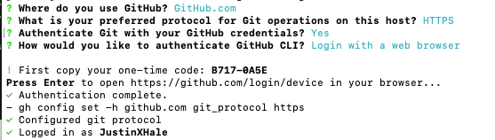
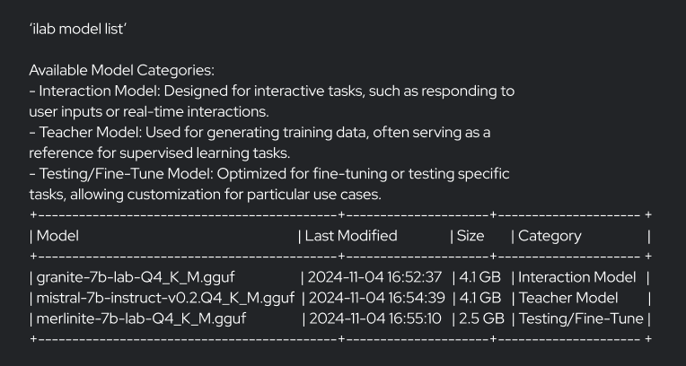

<table style="border: none; width: 100%;">
  <tr>
    <td style="text-align: left; width: 50%;">
      <a href="prerequisites.md">Back</a>
    </td>
    <td style="text-align: right; width: 50%;">
      <a href="next-page.md">Next</a>
    </td>
  </tr>
</table>

# Install Instructions for InstructLab (MacOS)
This guide will take you through the installation process for InstructLab. It includes setting up prerequisites, configuring accounts, and downloading necessary components. This guide is structured for interactive mode, simplifying the process step-by-step. If you have not check the per-requisities, visit per-requisites.md before proceeding.

# Step 1: Start Interactive Mode

Begin the setup process by starting interactive mode. This command will guide you through the entire setup process, including account setups, directory creation, and InstructLab installation.

```
ilab install instructlab
```

# Step 2: Account Setups

## Hugging Face
To download models later, you’ll need a Hugging Face API token. You can obtain one by:

- Visit [Huggingface.com](https://huggingface.co/){:target="_blank"}
- Create a Free Account
- Navigate to Settings > Access Tokens
- Create new Access Token with ‘READ’ permissions (token name doesnt matter)
- Create Token

Enter the token in the CLI

# Step 3: Connect GitHub Account
To contribute to an upstream repository or your personal one, you need to connect your GitHub account. If you don’t already have a free account, visit [GitHub.com](https://GitHub.com){:target="_blank"} to create one before proceeding.

Once your GitHub account is set up, run the following command in your terminal and follow the prompts:

```
gh auth login
```

### Recommended Selections:
- Select **GitHub.com** as the platform.
- Choose **HTTPS** as the protocol.
- Confirm by typing **Y** to continue.
- Opt to **Log in with a web browser** when prompted.

After completing these steps, your terminal will be authenticated with your GitHub account.



# Step 4: Installing InstructLab
Follow these steps to create and configure the required directory for InstructLab and begin the installation process.

## Create and Navigate to the Directory
Run the following commands to create and navigate to the InstructLab directory in the default location:

```
mkdir instructlab
cd instructlab
```
## Setup Python environment (venv)
These commands will create a Python virtual environment, activate it, and clean up any existing InstructLab installations or cached data:

```
python3 -m venv --upgrade-deps venv
source venv/bin/activate
pip uninstall instructlab
rm -rf "~/Library/Application Support/instructlab" ~/Library/Caches/instructlab
```

Once completed, you will see (venv) in your terminal prompt, indicating that you are now in the Python virtual environment. This environment is required to run InstructLab.

## Install InstructLab
- To avoid any dependency conflicts, remove cached dependencies for llama_cpp_python and install InstructLab using the following commands:

```
pip cache remove llama_cpp_python
pip install instructlab
```

- During installation, you will be prompted to select the desired version of InstructLab. Options may include:

```
Select version of InstructLab:
> [Default] 1.0.0
> 0.90.0
> 0.80.5
```
- Confirm the installation and version of InstructLab by running:

```
ilab --version
```

# Step 5: Configuring Instructlub 'ilab config init'
After successfully installing InstructLab, run the following command to start configuration:

```
ilab config init
```

## Taxonomy Repository Path
- You will be prompted to provide the path to the taxonomy repository. Press Enter to use the default path:

```
Path to taxonomy repo [/users/username/documents/instructlab/taxonomy]: ENTER
```

- If the directory does not exist or is empty, you will see this prompt:

```
‘/users/username/documents/instructlab/taxonomy’ does not exist or is empty.
How would you like to set up your taxonomy?
[1 - Default] Fork the taxonomy repo to your GitHub account and clone your fork? 
[2] Clone the upstream taxonomy repo directly (read-only mode). 
[3] Use an existing taxonomy directory.

Enter the number of your choice [1 - recommended]: 1
```

The system will then fork and clone the instruct lab taxonomy repository:

## Model directory path
- You will be asked to specify the path to your models. Press Enter to use the default path:

```
Path to your model [/users/username/documents/instructlab/models]: Press [ENTER]
```

## Generating Configuration Files
- The system will generate configuration files and profiles:
## Detecting Hardware Profile
- The system automatically detects your hardware profile.
## Configuration Complete
- Press [ENTER] to proceed downloading the models.

# Step 6 Downloading Models
Once the configuration process is complete, follow these steps to download the necessary models and verify their availability.

## Step 6.1: Proceed with Model Download
After completing the configuration, you will be prompted to proceed with downloading the models. Press ENTER to start the process.

```
ilab model download --hf-token ##########
```

Replace ########## with your Hugging Face token provided (if you are using manual mode) during the setup process. This token ensures the models are securely downloaded to your system.

### Model Download Process
During the download, you will see a status update indicating the progress of the download process. Ensure a stable internet connection while downloading large models to avoid interruptions.

### Verify Available Models
Once the download is complete, list the available models using the following command:

```
ilab model list
```

#### Example output


## Step 6.2 Installation Complete
Once the models are downloaded and listed successfully, the installation process is complete.

Next Steps: You are now ready to serve and chat with the models. Run the following command to start interacting with your model:

```
ilab model chat
```